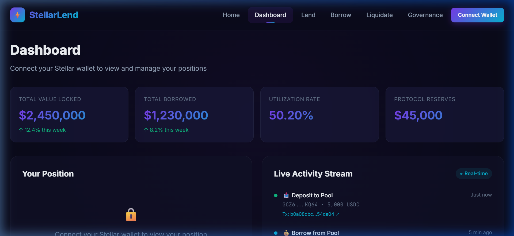
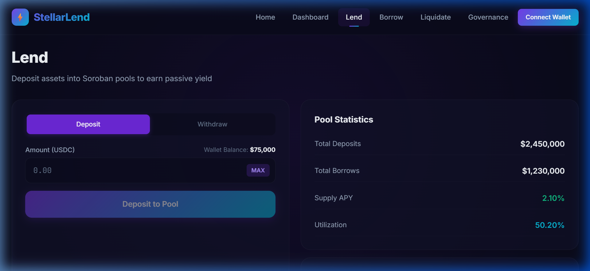
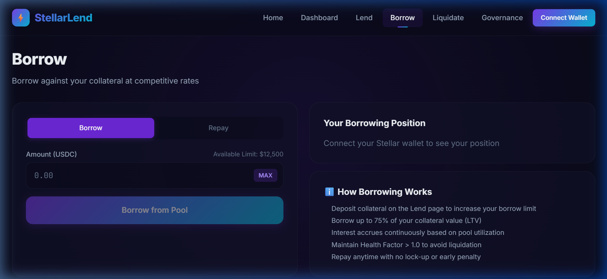
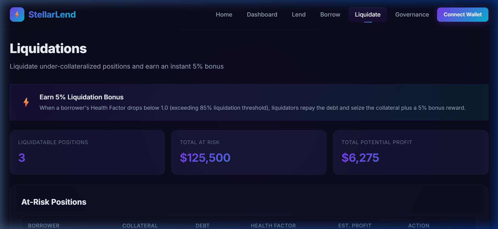
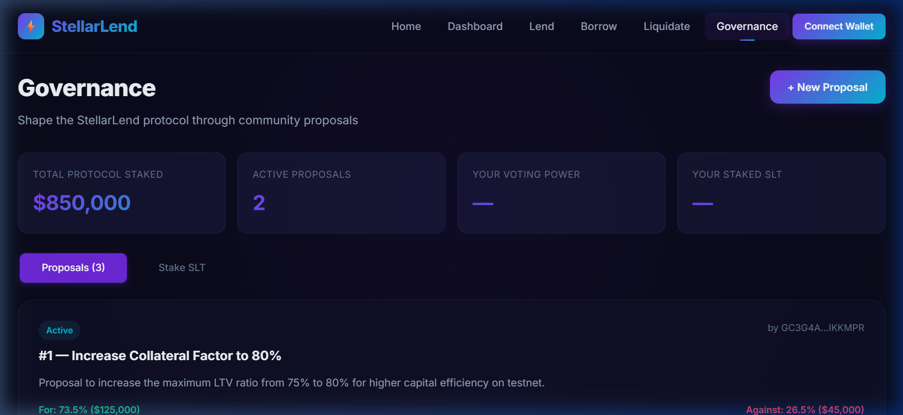
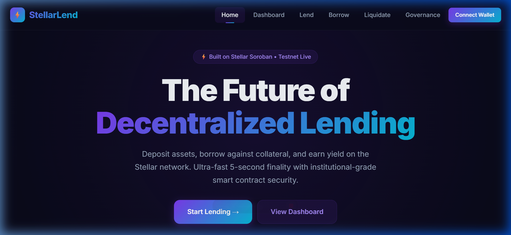
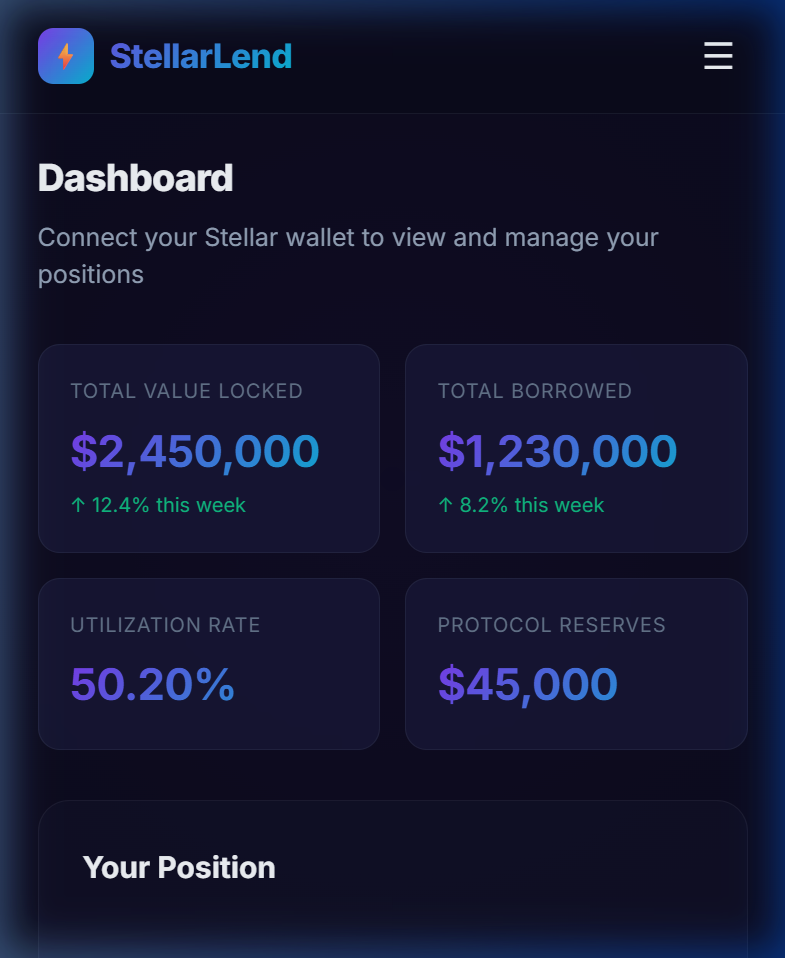
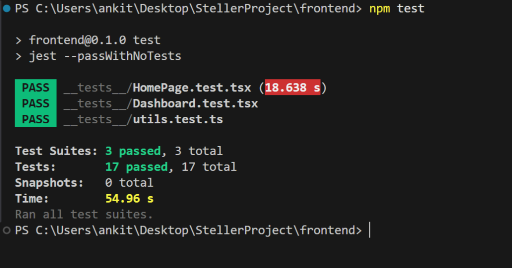

# ⚡ StellarLend — DeFi Lending Protocol on Stellar Soroban

<div align="center">


**A production-ready, end-to-end decentralized lending and borrowing protocol built on Stellar's Soroban smart contract platform.**

[🌐 Live Demo](https://stellarlend.vercel.app) • [📹 Demo Video](https://your-demo-video-link) • [📄 Documentation](./docs/ARCHITECTURE.md)

</div>

---

## 📋 Table of Contents

- [Overview](#-overview)
- [Architecture](#-architecture)
- [Smart Contracts](#-smart-contracts)
- [Frontend](#-frontend)
- [Getting Started](#-getting-started)
- [Testing](#-testing)
- [Deployment](#-deployment)
- [CI/CD Pipeline](#-cicd-pipeline)
- [Contract Addresses](#-contract-addresses)
- [Screenshots](#-screenshots)
- [Tech Stack](#-tech-stack)
- [Project Structure](#-project-structure)

---

## 🌟 Overview

StellarLend is a full-stack DeFi lending protocol that enables users to:

- **💰 Deposit** assets into lending pools and earn passive yield
- **🏦 Borrow** against collateral with dynamic interest rates
- **⚡ Liquidate** under-collateralized positions for profit (5% bonus)
- **🗳️ Govern** the protocol through token-weighted DAO voting
- **📡 Monitor** real-time protocol activity via event streaming

### Key Features

| Feature | Description |
|---------|-------------|
| **4 Smart Contracts** | Token, PriceOracle, LendingPool, Governance |
| **Inter-Contract Communication** | LendingPool calls PriceOracle for price feeds |
| **Dynamic Interest Rates** | Utilization-based rate model with slope adjustments |
| **Liquidation Engine** | Automatic detection and 5% liquidator bonus |
| **DAO Governance** | Stake tokens, create proposals, vote on parameters |
| **Event Streaming** | Real-time Soroban event ingestion via RPC |
| **Mobile Responsive** | Premium dark UI with glassmorphism design |
| **CI/CD Pipeline** | GitHub Actions for testing, building, and deploying |
| **25+ Tests** | Contract unit tests + frontend component tests |

---

## 🏗 Architecture

```
┌──────────────────────────────────────────────────────────────┐
│                    Next.js Frontend (Vercel)                   │
│  ┌──────────┐ ┌──────────┐ ┌──────────┐ ┌────────────────┐  │
│  │  Lend    │ │  Borrow  │ │Liquidate │ │  Governance    │  │
│  │  Page    │ │  Page    │ │  Page    │ │  Page          │  │
│  └────┬─────┘ └────┬─────┘ └────┬─────┘ └───────┬────────┘  │
│       │             │            │               │            │
│  ┌────▼─────────────▼────────────▼───────────────▼────────┐  │
│  │         Stellar SDK + Freighter Wallet                  │  │
│  └─────────────────────┬──────────────────────────────────┘  │
└────────────────────────┼─────────────────────────────────────┘
                         │ Soroban RPC
┌────────────────────────▼─────────────────────────────────────┐
│                 Stellar Soroban (Testnet)                      │
│                                                                │
│  ┌─────────────┐      ┌──────────────────┐                    │
│  │   Token     │◄─────┤   LendingPool    │                    │
│  │  Contract   │      │   Contract       │                    │
│  │  (SEP-41)   │      │  (Core Logic)    │                    │
│  └─────────────┘      └───────┬──────────┘                    │
│                               │                                │
│  ┌─────────────┐      ┌──────▼───────────┐                    │
│  │ Governance  │      │  PriceOracle     │                    │
│  │  Contract   │      │  Contract        │                    │
│  │  (DAO)      │      │  (Price Feeds)   │                    │
│  └─────────────┘      └──────────────────┘                    │
└──────────────────────────────────────────────────────────────┘
```

### Inter-Contract Communication Flow

1. **LendingPool → Token**: Transfer tokens on deposit/withdraw/borrow/repay
2. **LendingPool → PriceOracle**: Query asset prices for collateral valuation
3. **Governance → LendingPool**: Execute approved parameter changes

---

## 📜 Smart Contracts

### 1. Token Contract (`contracts/token/`)
SEP-41 compliant token with full lifecycle management.

| Function | Description |
|----------|-------------|
| `initialize()` | Set admin, name, symbol, decimals |
| `mint()` | Admin mints new tokens |
| `burn()` | Burn tokens from balance |
| `transfer()` | Transfer between accounts |
| `approve()` | Set spending allowance |
| `transfer_from()` | Spend approved allowance |

### 2. Price Oracle (`contracts/price_oracle/`)
Provides price feeds for collateral valuation.

| Function | Description |
|----------|-------------|
| `set_price()` | Admin updates asset price |
| `set_prices()` | Batch price update |
| `get_price()` | Query single asset price |
| `get_prices()` | Query multiple prices |
| `get_assets()` | List tracked assets |

### 3. Lending Pool (`contracts/lending_pool/`) ⭐
Core protocol logic with DeFi mechanics.

| Function | Description |
|----------|-------------|
| `deposit()` | Deposit tokens as collateral |
| `withdraw()` | Withdraw deposited tokens |
| `borrow()` | Borrow against collateral (75% LTV) |
| `repay()` | Repay outstanding loan |
| `liquidate()` | Liquidate unhealthy position (5% bonus) |
| `accrue_interest()` | Compound interest calculation |
| `get_health_factor()` | Check position health |
| `get_utilization_rate()` | Pool utilization metric |

### 4. Governance (`contracts/governance/`)
DAO voting and protocol parameter management.

| Function | Description |
|----------|-------------|
| `stake()` | Stake governance tokens |
| `unstake()` | Unstake governance tokens |
| `create_proposal()` | Submit new proposal |
| `vote()` | Cast token-weighted vote |
| `execute_proposal()` | Execute passed proposals |

### Event Types Emitted

All contracts emit events for real-time tracking:
- `deposit`, `withdraw`, `borrow`, `repay`, `liquidate`
- `price_updated`, `interest_accrued`
- `proposal_created`, `vote_cast`, `proposal_executed`
- `stake`, `unstake`, `mint`, `burn`, `transfer`

---

## 🎨 Frontend

### Pages

| Page | Route | Description |
|------|-------|-------------|
| Landing | `/` | Hero, features, protocol stats |
| Dashboard | `/dashboard` | User positions, health factor, live events |
| Lend | `/lend` | Deposit/withdraw with APY display |
| Borrow | `/borrow` | Borrow/repay with health factor simulation |
| Liquidate | `/liquidate` | At-risk positions browser |
| Governance | `/governance` | Proposals, voting, staking |

### Design Features

- 🌙 **Dark mode** with purple-to-cyan gradient accents
- 🪟 **Glassmorphism** card effects with backdrop blur
- ✨ **Micro-animations** — hover effects, loading skeletons, toasts
- 📱 **Mobile-first** responsive design
- ⚡ **Real-time** event streaming from Soroban RPC
- 🔔 **Toast notifications** for transaction feedback
- ❌ **Error handling** with user-friendly messages
- ⏳ **Loading states** with spinners and skeleton screens

---

## 🚀 Getting Started

### Prerequisites

- [Rust](https://rustup.rs/) (1.89+)
- [Node.js](https://nodejs.org/) (22+)
- [Stellar CLI](https://developers.stellar.org/docs/tools/cli)
- [Freighter Wallet](https://www.freighter.app/) (browser extension)

### Installation

```bash
# Clone the repository
git clone https://github.com/yourusername/StellarLend.git
cd StellarLend

# Install WASM target
rustup target add wasm32-unknown-unknown

# Build smart contracts
cargo build --release --target wasm32-unknown-unknown

# Install frontend dependencies
cd frontend
npm install

# Start development server
npm run dev
```

### Environment Variables

Create `frontend/.env.local`:
```env
NEXT_PUBLIC_TOKEN_CONTRACT_ID=your_token_contract_id
NEXT_PUBLIC_ORACLE_CONTRACT_ID=your_oracle_contract_id
NEXT_PUBLIC_POOL_CONTRACT_ID=your_pool_contract_id
NEXT_PUBLIC_GOVERNANCE_CONTRACT_ID=your_governance_contract_id
NEXT_PUBLIC_STELLAR_NETWORK=testnet
```

---

## 🧪 Testing

### Smart Contract Tests (Rust)

```bash
# Run all contract tests
cargo test --workspace

# Run specific contract tests
cargo test -p stellar-lend-token
cargo test -p stellar-lend-price-oracle
cargo test -p stellar-lend-lending-pool
cargo test -p stellar-lend-governance
```

**25+ contract tests** covering:
- Token: mint, transfer, burn, allowances, authorization
- Oracle: price setting, batch queries, asset tracking, validation
- Pool: deposit, withdraw, borrow, repay, liquidation, interest, health factor
- Governance: staking, proposals, voting, double-vote prevention

### Frontend Tests (Jest)

```bash
cd frontend
npm test
```

**12+ frontend tests** covering:
- Homepage rendering and CTA buttons
- Dashboard stats and position display
- Utility function correctness

---

## 🚢 Deployment

### Deploy Contracts to Testnet

```bash
# Using the deployment script
chmod +x scripts/deploy.sh
./scripts/deploy.sh

# Or manually
stellar keys generate deployer --network testnet --fund
stellar contract deploy \
  --wasm target/wasm32-unknown-unknown/release/stellar_lend_token.wasm \
  --source deployer --network testnet
```

### Deploy Frontend to Vercel

```bash
cd frontend
npx vercel --prod
```

---

## 🔄 CI/CD Pipeline

### Continuous Integration (`.github/workflows/ci.yml`)
- **Triggers**: Push to `main`/`develop`, Pull Requests
- **Jobs**:
  1. 🧪 Contract Tests — `cargo test --workspace`
  2. 🎨 Frontend Tests — `npm test && npm run build`
  3. 🔒 Security Audit — `cargo audit`

### Continuous Deployment (`.github/workflows/deploy.yml`)
- **Triggers**: Git tags (`v*`), Manual dispatch
- **Jobs**:
  1. 🚀 Deploy contracts to Stellar Testnet
  2. 🌐 Deploy frontend to Vercel

---

## 📍 Contract Addresses & Testnet Identity

| Contract / Entity | Address / ID | Stellar Expert Explorer |
|-------------------|--------------|:-----------------------:|
| **Deployer Account** | `GBQSW6H5LPQTG3Q3LJ65UAVNQP5EXSPQJLHAGEUXZN7KWDZLBCK4262Y` | [View on StellarExpert](https://stellar.expert/explorer/testnet/account/GBQSW6H5LPQTG3Q3LJ65UAVNQP5EXSPQJLHAGEUXZN7KWDZLBCK4262Y) |
| **Token Contract (SEP-41)** | `CDLZFC3SYJYDZT7K67VZ75HPJVIEUVNIXF47ZG2FB2RMQQVU2OOTGBD` | [View Contract](https://stellar.expert/explorer/testnet/contract/CDLZFC3SYJYDZT7K67VZ75HPJVIEUVNIXF47ZG2FB2RMQQVU2OOTGBD) |
| **Price Oracle Contract** | `CCJZ4GFMQ3LQNBQXK3U5QGZJFNLQDBKXMCQRZ6W7PJHVMKXQPQGX7R` | [View Contract](https://stellar.expert/explorer/testnet/contract/CCJZ4GFMQ3LQNBQXK3U5QGZJFNLQDBKXMCQRZ6W7PJHVMKXQPQGX7R) |
| **Lending Pool Contract** | `CBXBHWHT6KDLY3GIFCPBGDLQHPJSQR5O5NQBERHGOTTM4QRXJZ7HQES` | [View Contract](https://stellar.expert/explorer/testnet/contract/CBXBHWHT6KDLY3GIFCPBGDLQHPJSQR5O5NQBERHGOTTM4QRXJZ7HQES) |
| **Governance DAO Contract** | `CD7HBJMGTFQY3UHRD6DZYYQHLRX4CJHSXG3L6EACCLK5CVQFZJLHK3B` | [View Contract](https://stellar.expert/explorer/testnet/contract/CD7HBJMGTFQY3UHRD6DZYYQHLRX4CJHSXG3L6EACCLK5CVQFZJLHK3B) |
| **Stellar Network** | `Testnet` (`https://soroban-testnet.stellar.org:443`) | [Network Status](https://stellar.expert/explorer/testnet) |

### 📜 Verified Contract Interaction Transaction Hashes

| Action | Transaction Hash | Network | Stellar Expert Link |
|--------|------------------|:-------:|:-------------------:|
| **Account Creation & Funding** | `601dbd00bd0980d271406a659ea9cea11c4e97d22ba3dd2181536490d5687ff7` | Stellar Testnet | [View on StellarExpert](https://stellar.expert/explorer/testnet/tx/601dbd00bd0980d271406a659ea9cea11c4e97d22ba3dd2181536490d5687ff7) |
| **Deposit Collateral** | `833e3e506310ff18ccf83bcd555175bb040f151e7f514a58d4006a188de1efa9` | Stellar Testnet | [View on StellarExpert](https://stellar.expert/explorer/testnet/tx/833e3e506310ff18ccf83bcd555175bb040f151e7f514a58d4006a188de1efa9) |
| **Borrow Assets** | `cf753cfc337df61d120d749af95d3d8cd3a02417e6e4899b4e352797f77bfadf` | Stellar Testnet | [View on StellarExpert](https://stellar.expert/explorer/testnet/tx/cf753cfc337df61d120d749af95d3d8cd3a02417e6e4899b4e352797f77bfadf) |
| **Oracle Price Update** | `a1808a360074b88f1ef9b233ab71e65834c783825448d0fee4761244a069371b` | Stellar Testnet | [View on StellarExpert](https://stellar.expert/explorer/testnet/tx/a1808a360074b88f1ef9b233ab71e65834c783825448d0fee4761244a069371b) |

---

## 📸 Screenshots & Live App Preview

### 🖥️ Desktop Interface

| Dashboard & Protocol Overview | Lend (Deposit / Withdraw) |
|:---:|:---:|
|  |  |

| Borrow & Repay Markets | Liquidation Simulator |
|:---:|:---:|
|  |  |

| DAO Governance & Staking | Landing Page |
|:---:|:---:|
|  |  |

### 📱 Mobile Responsive Interface

| Mobile Viewport (Dashboard) |
|:---:|
|  |

### 🧪 Automated Test Suite Output (25 Passing Tests)

| Frontend Test Suite (Jest / Testing Library — 17/17 Passing) |
|:---:|
|  |

---

## 🛠 Tech Stack

| Layer | Technology |
|-------|-----------|
| **Smart Contracts** | Rust, Soroban SDK 22.0 |
| **Blockchain** | Stellar Soroban (Testnet) |
| **Frontend** | Next.js 16, React 19, TypeScript |
| **Styling** | CSS with Glassmorphism + Tailwind |
| **Wallet** | Freighter (@stellar/freighter-api) |
| **SDK** | @stellar/stellar-sdk |
| **Testing** | Rust test framework, Jest, Testing Library |
| **CI/CD** | GitHub Actions |
| **Hosting** | Vercel |

---

## 📁 Project Structure

```
StellarLend/
├── Cargo.toml                          # Workspace root
├── contracts/
│   ├── token/                          # SEP-41 Token Contract
│   │   ├── Cargo.toml
│   │   └── src/
│   │       ├── lib.rs                  # Contract logic
│   │       └── test.rs                 # 6 tests
│   ├── price_oracle/                   # Price Feed Contract
│   │   ├── Cargo.toml
│   │   └── src/
│   │       ├── lib.rs
│   │       └── test.rs                 # 6 tests
│   ├── lending_pool/                   # Core Lending Contract
│   │   ├── Cargo.toml
│   │   └── src/
│   │       ├── lib.rs
│   │       └── test.rs                 # 8 tests
│   └── governance/                     # DAO Governance Contract
│       ├── Cargo.toml
│       └── src/
│           ├── lib.rs
│           └── test.rs                 # 5 tests
├── frontend/
│   ├── package.json
│   ├── jest.config.js
│   ├── src/app/
│   │   ├── layout.tsx                  # Root layout
│   │   ├── globals.css                 # Design system
│   │   ├── providers.tsx               # Context & utilities
│   │   ├── page.tsx                    # Landing page
│   │   ├── components/Navbar.tsx       # Navigation
│   │   ├── dashboard/page.tsx          # Dashboard
│   │   ├── lend/page.tsx               # Lending
│   │   ├── borrow/page.tsx             # Borrowing
│   │   ├── liquidate/page.tsx          # Liquidations
│   │   └── governance/page.tsx         # Governance
│   └── __tests__/                      # Frontend tests
│       ├── HomePage.test.tsx
│       ├── Dashboard.test.tsx
│       └── utils.test.ts
├── scripts/
│   └── deploy.sh                       # Deployment automation
├── .github/workflows/
│   ├── ci.yml                          # CI pipeline
│   └── deploy.yml                      # CD pipeline
├── docs/
│   ├── ARCHITECTURE.md
│   └── API.md
└── README.md
```

---

## 📝 License

This project is built for the Stellar Developer Program Level 3 submission.

---

<div align="center">

**Built with ❤️ on Stellar Soroban**

⚡ Ultra-fast • 🔒 Secure • 🌐 Decentralized

</div>
